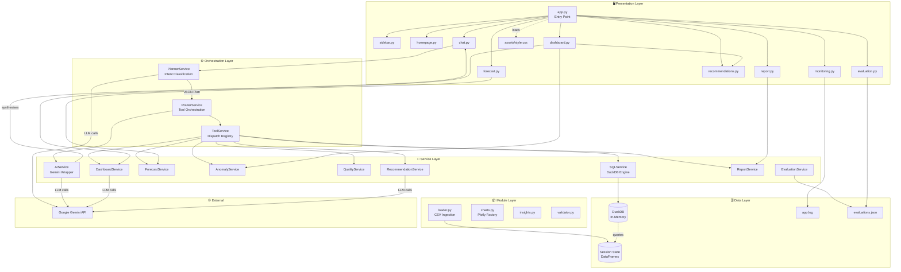
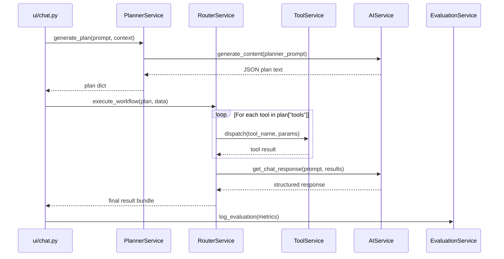
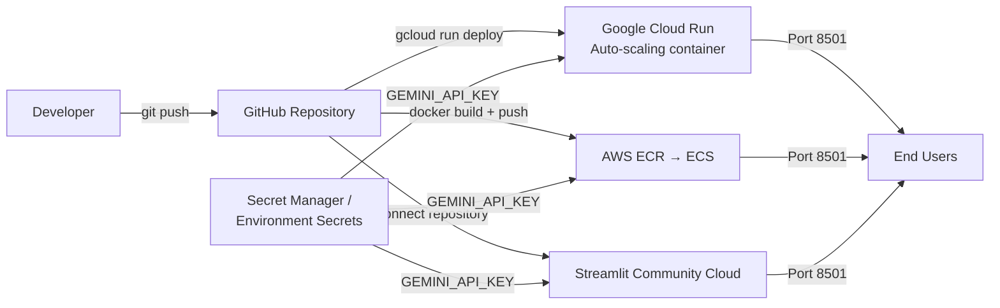

# 🏗️ Architecture — Enterprise AI Data Analyst

> Detailed technical documentation of the system design, component interactions,
> data flow, and deployment model for the Enterprise AI Data Analyst platform.

---

## Table of Contents

- [1. Overview](#1-overview)
- [2. Design Principles](#2-design-principles)
- [3. System Architecture](#3-system-architecture)
- [4. Layered Architecture](#4-layered-architecture)
- [5. Component Diagram](#5-component-diagram)
- [6. Request Lifecycle](#6-request-lifecycle)
- [7. AI Planner](#7-ai-planner--plannerservice)
- [8. Task Router](#8-task-router--routerservice)
- [9. DuckDB Integration](#9-duckdb-integration--sqlservice)
- [10. Gemini AI Integration](#10-gemini-ai-integration--aiservice)
- [11. Forecasting Engine](#11-forecasting-engine--forecastservice)
- [12. Anomaly Detection](#12-anomaly-detection--anomalyservice)
- [13. Visualisation Pipeline](#13-visualisation-pipeline)
- [14. Report Generation](#14-report-generation--reportservice)
- [15. Monitoring & Evaluation](#15-monitoring--evaluation)
- [16. Deployment Architecture](#16-deployment-architecture)
- [17. Session State Model](#17-session-state-model)
- [18. Security Architecture](#18-security-architecture)

---

## 1. Overview

**Enterprise AI Data Analyst** uses a custom **Planner-Router-Service** agentic architecture.
This pattern was deliberately chosen over framework-based alternatives (LangChain, AutoGen)
to achieve:

- **Full execution transparency** — every step is logged and inspectable
- **Security first** — SQL sandboxing built into the execution pipeline, not bolted on
- **Zero transitive bloat** — no framework overhead, pure Python service classes
- **Deterministic output formatting** — structured JSON plans, not free-form tool calls

The system processes a user's natural language query through five sequential stages:
**Ingestion → Planning → Routing → Execution → Synthesis**.

---

## 2. Design Principles

| Principle | Implementation |
|---|---|
| **Separation of Concerns** | Presentation (ui/), Orchestration (services/planner, router), Execution (services/sql, forecast, etc.), Data (duckdb, pandas) |
| **Fail-Safe Defaults** | Every service has try/except with fallback; Planner falls back to SQL on failure |
| **Auditability** | Every AI interaction logged with prompt, SQL, confidence, latency |
| **Security by Design** | SQL validated through 4-stage blocklist before any execution |
| **Performance** | `@st.cache_data` and `@st.cache_resource` prevent redundant computation |
| **Stateless Services** | All services are stateless class methods; state lives in `st.session_state` |

---

## 3. System Architecture

```
╔═════════════════════════════════════════════════════════════════════════════╗
║                         ENTERPRISE AI DATA ANALYST                          ║
╠═════════════════════════════════════════════════════════════════════════════╣
║                                                                              ║
║  ┌─────────────────────────────────────────────────────────────────────┐   ║
║  │                    PRESENTATION LAYER                                │   ║
║  │   app.py → Streamlit page config + tab routing                      │   ║
║  │                                                                      │   ║
║  │   ┌──────────┐ ┌──────┐ ┌───────────┐ ┌──────────┐ ┌──────────┐  │   ║
║  │   │ Homepage │ │ Chat │ │ Dashboard │ │ Forecast │ │  Report  │  │   ║
║  │   └──────────┘ └──────┘ └───────────┘ └──────────┘ └──────────┘  │   ║
║  │                                                                      │   ║
║  │   ┌──────────┐ ┌──────────┐ ┌─────────────┐ ┌──────────────────┐  │   ║
║  │   │ Sidebar  │ │ Evaluate │ │  Monitoring │ │  Recommendations │  │   ║
║  │   └──────────┘ └──────────┘ └─────────────┘ └──────────────────┘  │   ║
║  └──────────────────────────────────┬────────────────────────────────┘   ║
║                                     │                                        ║
║  ┌──────────────────────────────────▼────────────────────────────────┐   ║
║  │                   ORCHESTRATION LAYER                               │   ║
║  │                                                                      │   ║
║  │   PlannerService ──(Gemini)──► RouterService                        │   ║
║  │        │                            │                                │   ║
║  │   Generates JSON plan          Dispatches tools                     │   ║
║  └──────────────────────────────────┬────────────────────────────────┘   ║
║                                     │                                        ║
║  ┌──────────────────────────────────▼────────────────────────────────┐   ║
║  │                     EXECUTION LAYER                                 │   ║
║  │                                                                      │   ║
║  │  SQLService  │  ForecastService  │  AnomalyService  │  QualityService│   ║
║  │  ChartModule │  RecommendService │  DashboardService │  ReportService │   ║
║  └──────────────────────────────────┬────────────────────────────────┘   ║
║                                     │                                        ║
║  ┌──────────────────────────────────▼────────────────────────────────┐   ║
║  │                      DATA LAYER                                     │   ║
║  │                                                                      │   ║
║  │   DuckDB (in-memory)  │  Pandas DataFrames  │  CSV Upload Buffer   │   ║
║  └──────────────────────────────────┬────────────────────────────────┘   ║
║                                     │                                        ║
║  ┌──────────────────────────────────▼────────────────────────────────┐   ║
║  │                  OBSERVABILITY LAYER                                │   ║
║  │                                                                      │   ║
║  │   app.log (RotatingFileHandler)  │  evaluations.json               │   ║
║  └─────────────────────────────────────────────────────────────────────┘   ║
╚═════════════════════════════════════════════════════════════════════════════╝
```

---

## 4. Layered Architecture

### Layer 1 — Presentation (ui/ + app.py)

The UI layer uses Streamlit tabs, each rendered by a dedicated module in `ui/`:

```
app.py
├── Reads CSS from assets/style.css
├── Initialises session state keys
├── Calls render_sidebar() → handles file upload + dataset management
├── If no data loaded: renders homepage.py
└── If data loaded: renders tab interface
    ├── Tab 1: ui/chat.py         → InteractiveAnalysis
    ├── Tab 2: ui/dashboard.py    → AnalyticsDashboard
    ├── Tab 3: ui/forecast.py     → ForecastingTab
    ├── Tab 4: ui/report.py       → ReportGenerationTab
    ├── Tab 5: ui/evaluation.py   → EvaluationTab
    └── Tab 6: ui/monitoring.py   → MonitoringTab
```

### Layer 2 — Orchestration (services/planner_service.py + router_service.py)

The orchestration layer converts natural language to an execution plan:

```
PlannerService.generate_plan(prompt, data_context, chat_history)
    ├── Builds context string (dataset schemas + history)
    ├── Calls AIService.generate_content(planner_prompt)
    ├── Parses JSON plan: { tools, parameters, reasoning }
    └── Returns plan to RouterService

RouterService.execute_workflow(plan, data, ...)
    ├── Reads plan["tools"]
    ├── For each tool: calls ToolService.dispatch(tool_name, ...)
    ├── Aggregates results
    └── Calls AIService.get_chat_response() for synthesis
```

### Layer 3 — Execution (services/)

Each service is a focused, stateless class:

| Service | Responsibility |
|---|---|
| `SQLService` | Security validation → DuckDB execution → DataFrame result |
| `ForecastService` | Column detection → model selection → chart generation |
| `AnomalyService` | Algorithm dispatch → outlier labelling → scatter plot |
| `QualityService` | DataFrame profiling → score calculation → recommendations |
| `DashboardService` | Semantic type detection → KPI generation → chart recommendations |
| `RecommendationService` | Heuristic data mining → Gemini strategy report |
| `ReportService` | ReportLab layout → Kaleido chart export → PDF bytes |
| `EvaluationService` | Log read/write → metrics aggregation |

### Layer 4 — Data (DuckDB + Pandas)

All uploaded CSV data lives in two forms:
1. **Pandas DataFrames** in `st.session_state.data[filename]["df"]`
2. **DuckDB tables** registered on demand by `SQLService.execute_sql_query()`

```python
# Registration happens at SQL execution time:
conn.register(table_name, df)   # Registers Pandas DF as virtual SQL table
result_df = conn.execute(query).fetchdf()
```

### Layer 5 — Observability (logs/)

```
app.log
├── Format: [timestamp] LEVEL [module:lineno] - message
├── Rotating: 5MB max per file, 3 backup files
└── Parsed by: ui/monitoring.py via regex

evaluations.json
├── Format: JSON array of evaluation objects
├── Written by: services/evaluation_service.py
└── Read by: ui/evaluation.py for metrics display
```

---

## 5. Component Diagram



---

## 6. Request Lifecycle

### Stage 1: Ingestion

```
User uploads CSV file(s) via Streamlit uploader
    │
    ▼
modules/loader.py :: load_csv(file)
    ├── file.read() → bytes
    ├── chardet.detect(sample) → encoding
    ├── Header duplicate check (pre-parse)
    ├── pd.read_csv(io.BytesIO(bytes), encoding=encoding)
    ├── Validation: empty check
    ├── Statistics: describe(), isnull().sum(), dtypes
    └── Returns: { df, columns, shape, dtypes, stats, missing_values }
    │
    ▼
st.session_state.data[filename] = result_dict
```

### Stage 2: Planning

```
User submits prompt in chat → ui/chat.py
    │
    ▼
PlannerService.generate_plan(prompt, data_context, chat_history)
    │
    ├── Builds planner_prompt:
    │     - Dataset schemas (name + columns + row count for each)
    │     - Last 6 messages of conversation history
    │     - Available tool list: [SQL, Charts, Forecast, ...]
    │     - JSON output format specification
    │
    ├── Calls AIService.generate_content(planner_prompt)
    │     └── google.generativeai SDK call to Gemini
    │
    ├── Strips markdown backticks: response.replace("```json", "").replace("```", "")
    ├── json.loads(cleaned_text) → plan dict
    │
    └── Returns: {
            "reasoning": "step-by-step explanation",
            "tools": ["SQL", "Charts"],
            "parameters": {
                "selected_dataset": "superstore_sales",
                "sql_explanation": "...",
                "chart_type": "Bar",
                "chart_x": "Region",
                "chart_y": "Sales",
                ...
            }
        }
```

### Stage 3: Routing

```
RouterService.execute_workflow(plan, data, prompt, chat_history, ...)
    │
    ├── Reads plan["tools"] → e.g. ["SQL", "Charts"]
    │
    ├── For "SQL":
    │     └── ToolService → SQLService.execute_sql_query(sql, data_context)
    │           ├── validate_query() → 4-stage blocklist
    │           ├── register DataFrames as DuckDB tables
    │           ├── conn.execute(query).fetchdf()
    │           └── Returns: DataFrame or error string
    │
    ├── For "Charts":
    │     └── ToolService → charts.py :: create_chart(type, df, x, y)
    │           └── Returns: Plotly Figure object
    │
    ├── For "Forecast":
    │     └── ToolService → ForecastService.run_forecast(df, date_col, target_col, horizon)
    │           └── Returns: { forecast_df, chart, summary_stats, explanation }
    │
    └── Aggregates all tool results → result_bundle
```

### Stage 4: Synthesis

```
result_bundle → AIService.get_chat_response(prompt, context, chat_history)
    │
    ├── Builds synthesis_prompt:
    │     - User query
    │     - SQL results (as markdown table)
    │     - Chart description
    │     - Any tool output summaries
    │
    ├── Calls Gemini → structured natural language response
    │
    └── Returns: {
            "answer": "## Executive Summary...",
            "reasoning": "step-by-step analysis",
            "sql_query": "SELECT ...",
            "confidence": 95,
            "pandas_code": "df.groupby(...)",
            "has_chart": true,
            "chart": <Figure>,
            "result_df": <DataFrame>
        }
```

### Stage 5: Delivery + Logging

```
ui/chat.py renders:
    ├── st.chat_message("assistant") → answer card
    ├── st.expander("View Reasoning") → reasoning text
    ├── st.expander("View Generated SQL") → sql_query
    ├── st.expander("View SQL Results Table") → result_df
    ├── st.plotly_chart(chart) if has_chart
    └── st.download_button("Download SQL Results CSV")

EvaluationService.log_evaluation({
    "timestamp": ...,
    "prompt": ...,
    "generated_sql": ...,
    "confidence": ...,
    "execution_time": ...,
    "success": True
})
```

---

## 7. AI Planner — PlannerService

`services/planner_service.py`

The Planner is the first AI-powered stage of every request. It transforms a natural language question into a machine-executable JSON plan.

### Input

```python
{
    "prompt": "Show top 5 customers by sales",
    "data_context": {
        "superstore_sales.csv": <DataFrame>
    },
    "chat_history": [
        "User: Summarize this dataset.",
        "AI: The dataset contains 100 rows..."
    ]
}
```

### Output (JSON Plan)

```json
{
    "reasoning": "The user wants to rank customers by total sales. This requires a SQL aggregation query (SUM of Sales, GROUP BY Customer, ORDER BY DESC, LIMIT 5). No chart was requested.",
    "tools": ["SQL"],
    "parameters": {
        "selected_dataset": "superstore_sales",
        "sql_explanation": "SELECT Customer, SUM(Sales) AS Total_Sales FROM superstore_sales GROUP BY Customer ORDER BY Total_Sales DESC LIMIT 5",
        "chart_type": null,
        "chart_x": null,
        "chart_y": null
    }
}
```

### Fallback Behaviour

If Gemini is unavailable or returns malformed JSON, the Planner falls back:
```python
return {
    "reasoning": f"Planner failed: {e}. Defaulting to SQL.",
    "tools": ["SQL"],
    "parameters": {}
}
```

---

## 8. Task Router — RouterService

`services/router_service.py`

The Router is the execution orchestrator. It interprets the Planner's JSON output and dispatches each required tool in sequence.

### Tool Dispatch Map

```python
TOOL_MAP = {
    "SQL":               ToolService.run_sql,
    "Charts":            ToolService.run_chart,
    "Forecast":          ToolService.run_forecast,
    "Data Quality":      ToolService.run_quality,
    "Anomaly Detection": ToolService.run_anomaly,
    "Report Generation": ToolService.run_report,
}
```

### Execution Flow



---

## 9. DuckDB Integration — SQLService

`services/sql_service.py`

DuckDB is the primary analytical computation engine. It runs entirely in-memory, operating directly against Pandas DataFrames without any file I/O.

### Security Pipeline

```
Raw SQL Query
    │
    ├── Stage 1: Comment Blocking
    │   Rejects: -- / /* */ patterns
    │   Prevents: comment-based injection
    │
    ├── Stage 2: Multi-statement Blocking
    │   Rejects: semicolons in the middle of the query
    │   Prevents: stacked statement execution
    │
    ├── Stage 3: Keyword Blocklist (from config.py)
    │   Blocks: COPY, INSTALL, LOAD, ATTACH, DETACH, EXPORT, IMPORT,
    │           CREATE, DROP, DELETE, UPDATE, INSERT, ALTER, CALL,
    │           PRAGMA, EXEC, TRUNCATE, GRANT, REVOKE, REPLACE
    │   Matching: word boundary regex (\b keyword \b) to prevent partial matches
    │
    ├── Stage 4: SELECT-Only Constraint
    │   Requires: query must start with SELECT
    │   Prevents: any DDL/DML that bypassed the blocklist
    │
    └── EXECUTE (only if all stages pass)
        conn.register(table_name, df)  ← DataFrame → DuckDB virtual table
        conn.execute(query).fetchdf()  ← Returns Pandas DataFrame
```

### Connection Management

```python
@staticmethod
@st.cache_resource
def get_connection():
    return duckdb.connect(database=":memory:")
```

`@st.cache_resource` ensures a single DuckDB connection is reused across all reruns — avoiding reconnection overhead and preserving any session-scope registered tables.

---

## 10. Gemini AI Integration — AIService

`services/ai_service.py`

The AIService wraps all calls to the Google Gemini API with retry logic, model auto-selection, and structured response parsing.

### Capabilities Used

| Capability | Usage |
|---|---|
| `generateContent` | Planner, synthesis, dashboard summaries, recommendations |
| Context window | Up to last 6 chat history messages injected as context |
| Structured output | JSON extraction from free-form responses |

### Retry Logic

```python
for attempt in range(1, 4):
    try:
        response = client.models.generate_content(model=model, contents=prompt)
        return response.text
    except Exception as e:
        logger.warning(f"Attempt {attempt}/3 failed: {e}")
        time.sleep(2 ** attempt)  # Exponential back-off: 2s, 4s, 8s
raise RuntimeError("All 3 Gemini API attempts failed")
```

### Response Structure

Every chat response is parsed from Gemini into this structured dict:

```python
{
    "answer":       str,   # Markdown-formatted executive summary
    "reasoning":    str,   # Chain-of-thought explanation
    "sql_query":    str,   # Generated DuckDB SQL (if applicable)
    "confidence":   int,   # 0–100 model certainty score
    "pandas_code":  str,   # Python code snippet for reproducibility
    "has_chart":    bool,  # Whether a chart was generated
    "chart":        Figure # Plotly figure object (if applicable)
}
```

---

## 11. Forecasting Engine — ForecastService

`services/forecast_service.py`

### Model Selection Chain

```
ForecastService.run_forecast(df, date_col, target_col, horizon)
    │
    ├── Auto-detect date column (if not specified)
    │   └── Tests each column with pd.to_datetime(); selects first parseable
    │
    ├── Aggregate by date (sum or mean)
    │   └── df.groupby(date_col)[target_col].agg(method)
    │
    ├── Model priority:
    │   1. Prophet (if prophet package installed)
    │      └── Seasonality, holiday effects, trend decomposition
    │
    │   2. Statsmodels ExponentialSmoothing (if statsmodels installed)
    │      └── HW exponential smoothing, robust for moderate datasets
    │
    │   3. Scikit-Learn LinearRegression (always available)
    │      └── Numeric timestamp → target linear fit; minimal data baseline
    │
    └── Output:
        ├── Plotly figure: historical actuals + forecast + 95% CI band
        ├── forecast_df: DataFrame with date, forecast, lower_bound, upper_bound
        ├── summary_stats: { mean, min, max, total, trend_direction }
        └── explanation: Gemini-generated business interpretation
```

### Confidence Interval

The 95% confidence band is computed differently per model:
- **Prophet:** Built-in `yhat_lower`/`yhat_upper` from posterior sampling
- **Statsmodels:** Simulation-based standard error estimation
- **Linear Regression:** Manual ±1.96σ of residuals

---

## 12. Anomaly Detection — AnomalyService

`services/anomaly_service.py`

### Algorithm Details

```python
# Isolation Forest
from sklearn.ensemble import IsolationForest
clf = IsolationForest(contamination=0.05, random_state=42)
df["Anomaly"] = clf.fit_predict(numeric_features) == -1
df["AnomalyScore"] = clf.score_samples(numeric_features)

# Z-Score
z_scores = (df[numeric_cols] - df[numeric_cols].mean()) / df[numeric_cols].std()
df["Anomaly"] = (np.abs(z_scores) > 3.0).any(axis=1)

# IQR
Q1, Q3 = df[col].quantile(0.25), df[col].quantile(0.75)
IQR = Q3 - Q1
df["Anomaly"] = (df[col] < Q1 - 1.5*IQR) | (df[col] > Q3 + 1.5*IQR)
```

### Output Schema

| Column | Type | Description |
|---|---|---|
| `Anomaly` | bool | True if row is an outlier |
| `AnomalyScore` | float | Distance-based score (Isolation Forest only) |
| `Explanation` | str | Human-readable description of why the row is anomalous |

---

## 13. Visualisation Pipeline

`modules/charts.py`

### Chart Factory

```python
def create_chart(chart_type, df, x_col, y_col, title) -> go.Figure:
    """
    Supported types: Bar, Line, Scatter, Histogram, Pie, Box
    All charts use the plotly dark theme with consistent styling.
    """
```

### Chart Type Selection Logic

The Planner determines chart type from the user's query:

| Query Keywords | Chart Type |
|---|---|
| bar chart, column chart, compare | Bar |
| line chart, trend over time, over time | Line |
| scatter plot, correlation, vs | Scatter |
| distribution, histogram, frequency | Histogram |
| pie chart, share, proportion | Pie |
| box plot, spread, quartile | Box |

### Kaleido Export (for PDF)

```python
# In report_service.py:
import kaleido
fig.write_image(img_buffer, format="png", width=700, height=400, scale=2)
```

Charts are exported as high-DPI PNG (scale=2 → 1400×800px effective) before embedding in the PDF.

---

## 14. Report Generation — ReportService

`services/report_service.py`

### PDF Assembly Pipeline

```
ReportService.generate_report(data, chat_history, config)
    │
    ├── Create ReportLab SimpleDocTemplate (A4, margins)
    │
    ├── Cover Page
    │   ├── Company logo placeholder
    │   ├── Report title (from config)
    │   ├── Company name (from config)
    │   └── Generation timestamp
    │
    ├── Executive Summary
    │   └── First AI chat response summary (if exists)
    │
    ├── Dataset Overview
    │   └── Shape, columns, dtypes table for each loaded dataset
    │
    ├── KPI Summary
    │   └── Numeric column statistics (count, mean, min, max, std)
    │
    ├── AI Insights
    │   └── All AI answers from chat history
    │
    ├── SQL Queries Generated
    │   └── All DuckDB SQL queries from chat history
    │
    ├── Pandas Code Generated
    │   └── All pandas code snippets from chat history
    │
    ├── Charts Section
    │   └── For each dataset: auto-generate 2 charts → Kaleido PNG → embed
    │
    ├── Data Quality Report
    │   └── Missing values table, quality score, recommendations
    │
    ├── Forecast Results
    │   └── Forecast chart PNG + summary stats table (if forecast was run)
    │
    ├── Anomaly Report
    │   └── Anomaly count + flagged rows table (if anomaly detection was run)
    │
    └── Final Recommendations
        └── Heuristic recommendations from RecommendationService
    │
    └── Returns: BytesIO PDF buffer → Streamlit download button
```

---

## 15. Monitoring & Evaluation

### Monitoring — ui/monitoring.py

```
Read logs/app.log
    │
    ├── _parse_log_file()
    │   └── Regex: r'\[(\d{4}-\d{2}-\d{2} \d{2}:\d{2}:\d{2})\] (\w+) \[([^\]]+)\] - (.+)'
    │   └── Extracts: timestamp, level, module, message
    │   └── Categorises: AI Request / SQL Request / Forecast / Anomaly / Error / etc.
    │
    ├── Compute session statistics
    │   └── Counts by category, latency extraction via regex
    │
    └── Render Plotly charts:
        ├── Request Type Distribution (px.pie, donut)
        ├── Total Events by Category (px.bar)
        ├── Request Activity Over Time (px.bar, 10-min buckets, stacked)
        ├── AI Response Latency Over Time (px.line)
        └── Error Events by Hour (px.bar)
```

### Evaluation — EvaluationService + ui/evaluation.py

```
Every AI chat interaction:
    │
    ├── EvaluationService.log_evaluation({
    │       "timestamp": datetime.now().isoformat(),
    │       "prompt": user_prompt,
    │       "generated_sql": sql_query,
    │       "confidence": confidence_score,
    │       "execution_time": elapsed_seconds,
    │       "success": True/False,
    │       "failure_reason": None,
    │       "user_feedback": "Pending"
    │   })
    │
    └── Writes to logs/evaluations.json (JSON array, append mode)

ui/evaluation.py reads evaluations.json:
    ├── Metrics: total queries, avg latency, avg confidence, SQL success rate
    ├── Chart: dual-axis (latency + confidence over time)
    └── Table: full interaction diagnostic log
```

---

## 16. Deployment Architecture

### Local Development

```
Developer Machine
    │
    └── streamlit run app.py
            └── http://localhost:8501
```

### Docker (Recommended)

```
Docker Host
    │
    └── docker run -p 8501:8501 --env-file .env enterprise-ai-analyst
            │
            └── Container: python:3.11-slim
                    ├── /app → all application files
                    ├── port 8501 exposed
                    ├── GEMINI_API_KEY from environment
                    └── logs/ written to /app/logs/
```

### Cloud Deployment



### Deployment Checklist

| Step | Detail |
|---|---|
| Set `GEMINI_API_KEY` | Via environment variable, never in source code |
| Port 8501 | Must be accessible from load balancer / internet |
| Stateless design | No persistent disk required (logs are ephemeral) |
| Memory | Minimum 1 GB RAM recommended for ML operations |
| CPU | 1 vCPU sufficient for single-user; 2+ for concurrent use |

---

## 17. Session State Model

Streamlit's `st.session_state` acts as the application's in-session database:

```python
st.session_state = {
    # Core data store
    "data": {
        "filename.csv": {
            "df": pd.DataFrame,
            "columns": list[str],
            "shape": tuple[int, int],
            "dtypes": dict[str, str],
            "stats": dict,
            "missing_values": dict[str, int]
        }
    },

    # Chat history
    "chat_history": list[dict],      # {role, content, sql, chart, df, ...}
    "conversation_history": list[str], # Plain text for context injection

    # Cached AI responses (avoid redundant API calls on reruns)
    "dashboard_summary_{filename}": str,
    "recommendation_results": dict,
    "anomaly_results": dict,

    # UI state
    "active_tab": str,
    "hero_uploader": list[UploadedFile],
    "sidebar_uploader": list[UploadedFile],
}
```

---

## 18. Security Architecture

### Threat Model

| Threat | Mitigation |
|---|---|
| SQL Injection via prompt | 4-stage query blocklist, SELECT-only enforcement |
| Destructive SQL (DROP, DELETE) | Keyword blocklist with word-boundary regex |
| Data exfiltration via COPY | COPY/EXPORT/INSTALL blocked |
| API key exposure | Environment variable only; `.env` in `.gitignore` |
| Secrets in Docker image | API key passed at runtime, never in `COPY . .` |
| Prompt injection | User input sandboxed in `<user_query>` tags in system prompt |
| Malicious CSV uploads | Pandas parsing with exception handling; no exec of content |
| Log injection | Structured log formatter sanitises newlines |

### SQL Security Blocklist (from config.py)

```python
BLOCKED_SQL_KEYWORDS = [
    "COPY", "INSTALL", "LOAD", "ATTACH", "DETACH",
    "EXPORT", "IMPORT", "CREATE", "DROP", "DELETE",
    "UPDATE", "INSERT", "ALTER", "CALL", "PRAGMA",
    "EXEC", "TRUNCATE", "GRANT", "REVOKE", "REPLACE"
]
```

Matching uses `re.search(r'\b' + kw + r'\b', sql_upper)` — word-boundary anchoring prevents false positives (e.g. `CREATE` in a column name does not match `CREATED_AT`).

---

*Architecture documented for: Enterprise AI Data Analyst v1.0*  
*Author: Nithin G J*  
*Assignment: Digital Back Office — AI Engineer*
