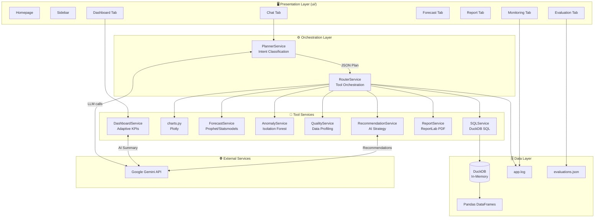
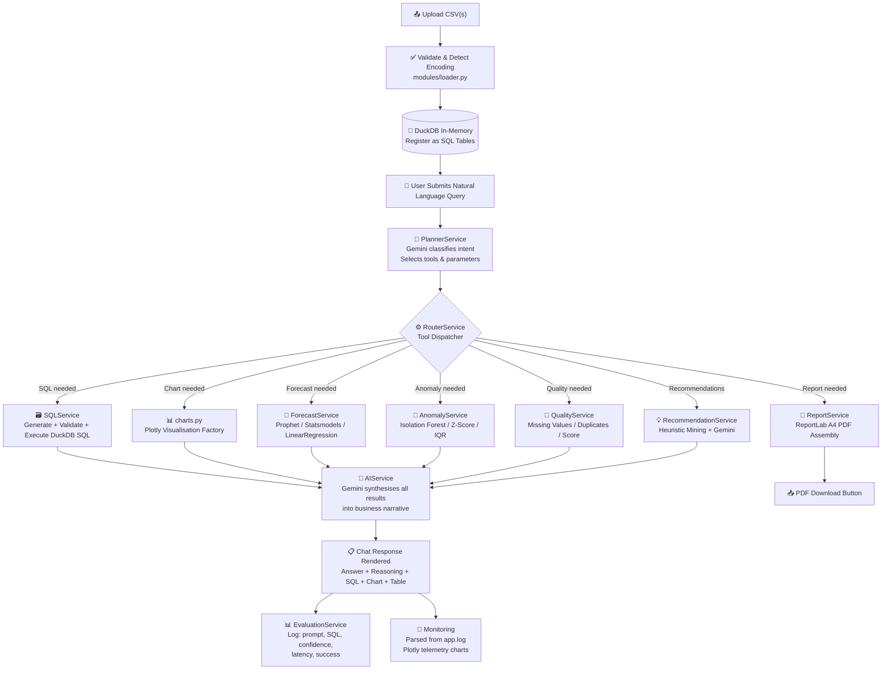

<div align="center">


# 🤖 Enterprise AI Data Analyst

### Transform Raw CSV Data Into Actionable Business Intelligence — Instantly

**A production-ready, agentic AI analytics platform powered by Google Gemini, DuckDB, and Streamlit.**  
Upload any CSV. Ask anything. Get insights, SQL, charts, forecasts, anomaly reports, and PDF exports — no code required.

---

[](https://python.org)
[](https://streamlit.io)
[](https://ai.google.dev)
[](https://duckdb.org)
[](https://docker.com)
[](LICENSE)

---


*The home interface — drag-and-drop CSV upload with sidebar navigation guide and feature highlights.*

</div>

---

## 🎥 Demo Video

> **Full feature walkthrough** — all 15 capabilities demonstrated end-to-end (~5 minutes).

<video src="Demo Video.mp4" width="100%" controls></video>

> *If your browser does not support the video player, click to view: [Demo Video.mp4](Demo%20Video.mp4)*

**Features demonstrated:**
CSV Upload → AI Chat → Dashboard → SQL Generation → Multi-file Analysis → Forecasting → Anomaly Detection → Data Quality → Recommendations → PDF Report → Monitoring → Evaluation

---

## 📋 Table of Contents

<details open>
<summary><strong>Expand Navigation</strong></summary>

| Section | Description |
|---|---|
| [🧩 Problem Statement](#-problem-statement) | Why this project exists |
| [💡 Project Overview](#-project-overview) | What it does and who it's for |
| [✨ Features](#-features) | All capabilities at a glance |
| [🛠️ Technology Stack](#-technology-stack) | Every tool and library used |
| [🏗️ System Architecture](#-system-architecture) | Design patterns and component diagram |
| [🔄 Workflow](#-high-level-workflow) | Request lifecycle, Mermaid diagram |
| [📸 Screenshots](#-screenshots) | All 12 application screenshots |
| [🐳 Docker Deployment](#-docker-deployment) | Full Docker guide — build, run, deploy |
| [🚀 Installation](#-local-installation) | Step-by-step local setup |
| [⚙️ Environment Variables](#-environment-variables) | Configuration reference |
| [📂 Sample Datasets](#-sample-datasets) | 5 curated demonstration CSVs |
| [🗂️ Project Structure](#-project-structure) | Annotated file tree |
| [🤖 AI Capabilities](#-ai-capabilities-deep-dive) | Deep-dive into every AI feature |
| [🛡️ Security](#-security-considerations) | SQL sandboxing and safety model |
| [🔥 Error Handling](#-error-handling--resilience) | Failure modes and recovery |
| [⚡ Performance](#-performance) | Benchmarks and optimizations |
| [📝 Implementation Notes](#-implementation-notes) | Assumptions, decisions, trade-offs |
| [✅ Assignment Checklist](#-assignment-requirements-checklist) | Every requirement mapped to code |
| [🔭 Future Improvements](#-future-improvements) | Roadmap and enhancements |
| [👤 Author](#-author) | Contact and attribution |

</details>

---

## 🧩 Problem Statement

Data analysis is bottlenecked by **technical barriers** that exclude most business users:

| Barrier | Impact |
|---|---|
| Writing SQL requires training | Business users cannot self-serve data questions |
| BI dashboards are slow to configure | Analysis takes days instead of minutes |
| Anomaly detection needs ML expertise | Problems go undetected until too late |
| Forecasting requires data science skills | Business planning relies on intuition |
| Reports are manually assembled | Executive communication is time-consuming |
| No visibility into AI behaviour | Black-box AI erodes user trust |

**Enterprise AI Data Analyst eliminates every one of these barriers** — replacing months of BI setup with a drag-and-drop upload and a plain-English question.

---

## 💡 Project Overview

**Enterprise AI Data Analyst** is a production-ready, full-stack AI analytics application that allows any business user to:

1. **Upload** one or more CSV datasets (no size preparation required)
2. **Ask** analytical questions in plain English
3. **Receive** structured AI responses: executive summaries, DuckDB SQL, Plotly charts, forecasts, anomaly reports, and PDF exports
4. **Monitor** the AI system's performance, confidence, and query history
5. **Export** branded PDF reports consolidating all insights into a single document

The application uses a custom **Planner → Router → Tool** agentic architecture, powered by **Google Gemini AI** as the reasoning engine and **DuckDB** as the in-memory analytical database. This design avoids heavy LangChain/AutoGen dependencies while delivering full agentic behaviour with deterministic, auditable outputs.

### Who It Is For

| Role | Use Case |
|---|---|
| **Business Analyst** | Self-serve data exploration without writing code |
| **Product Manager** | Rapid KPI dashboards from exported product data |
| **Executive** | One-click PDF reports with AI-generated insights |
| **Data Engineer** | Prototype analytics pipelines and validate data quality |
| **Intern / Researcher** | Learn AI-augmented analytics workflows |

---

## ✨ Features

### Core Features

| Feature | Status | Description |
|---|:---:|---|
| CSV Upload | ✅ | Secure upload with encoding detection, type inference, and validation |
| Multiple CSV Upload | ✅ | Upload and simultaneously analyse multiple related datasets |
| Natural Language Q&A | ✅ | Ask analytical questions in plain English, receive structured answers |
| Business Insights | ✅ | Gemini-generated executive summaries with KPI tables |
| Transparent AI Reasoning | ✅ | Expandable chain-of-thought reasoning for every response |
| SQL Generation | ✅ | Automated, sandboxed DuckDB SQL from natural language |
| DuckDB Execution | ✅ | Fast in-memory SQL with result tables and CSV export |
| Pandas Code Generation | ✅ | Auto-generated Python snippets for reproducibility |
| Interactive Charts | ✅ | Dynamic Plotly visualisations (Bar, Line, Scatter, Pie, Histogram, Box) |
| Conversation Memory | ✅ | Context-aware follow-up questions across the entire session |

### Advanced AI Features

| Feature | Status | Description |
|---|:---:|---|
| 🎯 Adaptive Dashboard | ✅ | Domain-aware KPIs auto-detected per dataset type (Sales / Finance / HR / Stock) |
| 🔮 Predictive Forecasting | ✅ | Prophet → Statsmodels → Linear Regression fallback chain |
| 🚨 Anomaly Detection | ✅ | Isolation Forest, Z-Score, IQR with scatter plot visualisation |
| 🧹 Data Quality Audit | ✅ | Missing values, duplicates, quality score (0–100), severity classification |
| 💡 Recommendation Engine | ✅ | Gemini-powered strategic business recommendations from data mining |
| 🔗 Multi-file Analysis | ✅ | Cross-dataset SQL joins and relational queries |
| 📄 PDF Report Export | ✅ | Branded A4 PDF with charts, KPIs, SQL, forecasts, anomaly reports |
| 📡 Observability Monitoring | ✅ | Live telemetry from log parsing — charts, latency, error tracking |
| 📊 AI Evaluation Framework | ✅ | Every interaction logged with confidence, latency, SQL, and success status |
| 🧠 Agentic Workflow | ✅ | Custom Planner → Router → ToolService pipeline |
| 🐳 Docker Support | ✅ | Fully containerised, one-command deployment |

---

## 🛠️ Technology Stack

| Layer | Technology | Purpose |
|---|---|---|
| **UI / Frontend** | Streamlit 1.42+ | Web interface, tabs, reactive state |
| **Backend Language** | Python 3.11+ | Core application logic |
| **Data Processing** | Pandas, NumPy | DataFrame operations, statistics |
| **AI / LLM** | Google Gemini (google-genai SDK) | Natural language understanding, SQL generation, summarisation |
| **Analytical Database** | DuckDB | In-memory SQL engine for fast aggregations |
| **Visualisation** | Plotly Express & Graph Objects | Interactive charts |
| **Forecasting** | Prophet, Statsmodels, Scikit-Learn | Time-series prediction with fallback chain |
| **Anomaly Detection** | Scikit-Learn (IsolationForest) | Outlier detection |
| **PDF Reporting** | ReportLab | Programmatic A4 PDF generation |
| **Chart Export** | Kaleido | Static PNG export of Plotly charts for PDF embedding |
| **Encoding Detection** | chardet | Automatic CSV encoding inference |
| **Deployment** | Docker, python-dotenv | Containerisation and environment management |
| **Logging** | Python logging + RotatingFileHandler | Structured runtime log management |

---

## 🏗️ System Architecture

The application is built on a **Layered Agentic Architecture** — a custom Planner-Router-Service pattern that replaces bulky third-party agent frameworks with a lightweight, fully auditable execution pipeline.

### Architectural Layers

```
┌─────────────────────────────────────────────────────────────────────────────┐
│                          PRESENTATION LAYER                                  │
│                           (ui/ + app.py)                                     │
│                                                                               │
│   Homepage │ Sidebar │ Chat │ Dashboard │ Forecast │ Report │ Eval │ Monitor  │
└─────────────────────────────┬───────────────────────────────────────────────┘
                              │  User prompt + data context
                              ▼
┌─────────────────────────────────────────────────────────────────────────────┐
│                          ORCHESTRATION LAYER                                  │
│                     (PlannerService + RouterService)                          │
│                                                                               │
│  1. PlannerService → Calls Gemini to classify intent and select tools        │
│  2. RouterService  → Executes selected tools sequentially                    │
└──────┬──────────┬────────────┬──────────────┬────────────┬───────────────────┘
       │          │            │              │            │
       ▼          ▼            ▼              ▼            ▼
┌──────────┐ ┌─────────┐ ┌──────────┐ ┌──────────┐ ┌──────────────┐
│ SQL      │ │ Charts  │ │ Forecast │ │ Anomaly  │ │ Quality /    │
│ Service  │ │ Module  │ │ Service  │ │ Service  │ │ Report / Rec │
└────┬─────┘ └────┬────┘ └────┬─────┘ └────┬─────┘ └──────┬───────┘
     │            │           │             │              │
     ▼            ▼           ▼             ▼              ▼
┌─────────────────────────────────────────────────────────────────────────────┐
│                           DATA / INFRASTRUCTURE LAYER                         │
│                                                                               │
│   DuckDB (in-memory) │ Pandas DataFrames │ app.log │ evaluations.json        │
└─────────────────────────────────────────────────────────────────────────────┘
                              │
                              ▼
┌─────────────────────────────────────────────────────────────────────────────┐
│                         OBSERVABILITY LAYER                                   │
│                  (MonitoringTab + EvaluationService)                          │
│                                                                               │
│   Log parsing → Plotly telemetry charts │ AI interaction metrics tracking    │
└─────────────────────────────────────────────────────────────────────────────┘
```

### Component Diagram (Mermaid)



---

## 🔄 High-Level Workflow

### Request Lifecycle

When a user submits a natural language query, the following pipeline executes:

```
User Query
    │
    ▼
1. PlannerService.generate_plan()
   └── Calls Gemini with: query + dataset schemas + conversation history
   └── Returns: JSON plan { tools: [...], parameters: {...}, reasoning: "..." }
    │
    ▼
2. RouterService.execute_workflow()
   └── Reads tool list from plan
   └── Sequentially dispatches to: ToolService → SQLService / ForecastService / etc.
    │
    ▼
3. Tool Execution
   ├── SQL: Generates query → validates blocklist → executes in DuckDB
   ├── Charts: Selects chart type → calls Plotly factory
   ├── Forecast: Detects date/target columns → runs model chain → plots result
   ├── Anomaly: Runs Isolation Forest → flags rows → generates scatter plot
   ├── Quality: Profiles dataset → calculates score → returns warnings
   └── Report: Assembles all results → ReportLab PDF
    │
    ▼
4. AIService.get_chat_response()
   └── Sends all tool results to Gemini for natural language synthesis
   └── Returns: { answer, reasoning, sql_query, confidence, pandas_code, ... }
    │
    ▼
5. EvaluationService.log_evaluation()
   └── Stores: prompt, SQL, confidence, execution_time, success to evaluations.json
    │
    ▼
6. UI Render
   └── Displays: answer card, SQL expander, chart, data table, download buttons
```

### End-to-End Mermaid Diagram



---

## 📸 Screenshots

All screenshots are from a live session using the included sample datasets.

---

### 1 · Home Interface
**Purpose:** Entry point — drag-and-drop upload with sidebar step guide and feature card grid.  
**Prompt used:** *(No prompt — initial state)*


---

### 2 · AI Executive Summary
**Purpose:** Natural language summary of an uploaded dataset with structured KPI tables.  
**Prompt used:** `"Summarize this dataset."`


---

### 3 · Top Customers — SQL Results
**Purpose:** Ranked customer table from AI-generated DuckDB SQL query.  
**Prompt used:** `"Show top 5 customers by sales."`


---

### 4 · SQL Generation & Reasoning Panel
**Purpose:** Transparent expandable panels showing AI reasoning, generated SQL, and result table with CSV download.  
**Expected Output:** `View Reasoning → View Generated SQL → View SQL Results Table → Download SQL Results`


---

### 5 · Bar Chart — Sales by Region
**Purpose:** AI-generated Plotly bar chart with regional sales narrative and market share breakdown table.  
**Prompt used:** `"Generate a bar chart of sales by region."`


---

### 6 · Multi-file Analysis — Revenue per Customer
**Purpose:** Cross-dataset SQL JOIN between `customers.csv` and `orders.csv`, returning ranked revenue table.  
**Prompt used:** `"Join these datasets and show revenue per customer."`


---

### 7 · Anomaly Detection — Isolation Forest
**Purpose:** Outlier detection profile with flagged rows table, anomaly scores, explanations, and feature-space scatter plot.  
**Method:** Isolation Forest (Default)


---

### 8 · Predictive Forecasting — Time Series
**Purpose:** 30-day stock price forecast with 95% confidence interval, historical actuals, and CSV download.  
**Dataset:** `stock_market.csv` | **Target:** `Close` price


---

### 9 · Report Generation — Configuration Panel
**Purpose:** PDF report configuration with section availability preview and one-click generation.  
**Output:** Branded A4 PDF with 12 sections populated.


---

### 10 · Observability Monitoring Dashboard
**Purpose:** Live telemetry from log parsing — donut chart, stacked activity timeline, latency graph, error frequency.


---

### 11 · Evaluation — Interaction Diagnostic Log
**Purpose:** Every AI query logged with prompt, generated SQL, confidence score, latency, and success status.


---

### 12 · Log Explorer
**Purpose:** Filterable real-time log viewer by level (INFO/WARNING/ERROR), category, and message search.


---

## 🐳 Docker Deployment

Docker is a **first-class deliverable** for this project. The application is fully containerised and production-ready with a single `docker run` command.

### Why Docker?

| Benefit | Detail |
|---|---|
| **Zero environment setup** | No Python installation or pip management on the host |
| **Reproducible builds** | Identical environment across dev, staging, and production |
| **Isolation** | Application dependencies don't conflict with the host system |
| **Portability** | Deploy to any Docker-compatible host in minutes |
| **Production-ready** | Optimised Python 3.11-slim base with build caching |

---

### Docker Architecture

```
┌─────────────────────────────────────────────────────┐
│                  Docker Container                    │
│                                                      │
│  Base Image: python:3.11-slim                        │
│  WORKDIR: /app                                       │
│                                                      │
│  ┌──────────────────────────────────────────────┐   │
│  │  Streamlit App (app.py)                       │   │
│  │  └── All services, modules, UI components     │   │
│  │  └── Reads GEMINI_API_KEY from environment    │   │
│  │  └── Writes logs to /app/logs/                │   │
│  └──────────────────────────────────────────────┘   │
│                                                      │
│  Port 8501 → Exposed to host                         │
│                                                      │
└────────────────────┬────────────────────────────────┘
                     │ -p 8501:8501
                     ▼
              http://localhost:8501
```

---

### Dockerfile (Annotated)

```dockerfile
# Lightweight Python 3.11 base — minimal attack surface
FROM python:3.11-slim

# Prevent .pyc files, enable unbuffered logs for Docker log collection
ENV PYTHONDONTWRITEBYTECODE=1
ENV PYTHONUNBUFFERED=1
ENV PYTHONUTF8=1

WORKDIR /app

# Install system build tools (required for some ML packages)
RUN apt-get update && apt-get install -y --no-install-recommends \
    build-essential \
    && rm -rf /var/lib/apt/lists/*

# Copy requirements first → Docker layer caching avoids re-installing on code changes
COPY requirements.txt .
RUN pip install --no-cache-dir -r requirements.txt

# Copy application source (after dependencies for optimal cache hits)
COPY . .

EXPOSE 8501

CMD ["streamlit", "run", "app.py", "--server.port=8501", "--server.address=0.0.0.0"]
```

---

### Quick Start — Docker

**Step 1: Clone the repository**
```bash
git clone https://github.com/NithinGJ2005/AI_Powered_Data_Analyst.git
cd AI_Powered_Data_Analyst
```

**Step 2: Build the image**
```bash
docker build -t enterprise-ai-analyst .
```

**Step 3: Run the container**
```bash
# Option A — Pass API key directly
docker run -p 8501:8501 \
  -e GEMINI_API_KEY="your_gemini_api_key_here" \
  enterprise-ai-analyst

# Option B — Use a .env file (recommended)
docker run -p 8501:8501 \
  --env-file .env \
  enterprise-ai-analyst

# Option C — Mount logs directory for persistence
docker run -p 8501:8501 \
  --env-file .env \
  -v $(pwd)/logs:/app/logs \
  enterprise-ai-analyst
```

**Step 4: Open in browser**
```
http://localhost:8501
```

---

### .env File Setup

Create a `.env` file in the project root (never commit this to Git):

```env
# Required: Google Gemini API Key
# Get yours at: https://aistudio.google.com/app/apikey
GEMINI_API_KEY=your_gemini_api_key_here
```

---

### Production Deployment Options

| Platform | Command |
|---|---|
| **Local Docker** | `docker run -p 8501:8501 --env-file .env enterprise-ai-analyst` |
| **Google Cloud Run** | `gcloud run deploy --source . --set-env-vars GEMINI_API_KEY=...` |
| **AWS ECS** | Push to ECR, define task definition with port 8501 |
| **Azure Container Apps** | `az containerapp up --source . --env-vars GEMINI_API_KEY=...` |
| **Streamlit Cloud** | Connect GitHub repo, set GEMINI_API_KEY in Secrets |

---

### Docker Capability Matrix

| Capability | Status |
|---|:---:|
| Python 3.11-slim base image | ✅ |
| Multi-layer build caching | ✅ |
| Environment variable driven | ✅ |
| Port 8501 exposed | ✅ |
| `.dockerignore` configured | ✅ |
| No secrets baked into image | ✅ |
| Stateless container design | ✅ |
| Compatible with Cloud Run, ECS, ACA | ✅ |

---

## 🚀 Local Installation

### Prerequisites

| Requirement | Version | Notes |
|---|---|---|
| Python | 3.11+ | [Download](https://python.org/downloads) |
| Git | Any | [Download](https://git-scm.com) |
| Google Gemini API Key | — | [Get free key](https://aistudio.google.com/app/apikey) |

---

### Step-by-Step Setup

```bash
# 1. Clone the repository
git clone https://github.com/NithinGJ2005/AI_Powered_Data_Analyst.git
cd AI_Powered_Data_Analyst

# 2. Create a virtual environment
python -m venv venv

# Activate — Windows
venv\Scripts\activate

# Activate — macOS / Linux
source venv/bin/activate

# 3. Install all dependencies
pip install -r requirements.txt

# 4. Create your environment file
cp .env.example .env         # If .env.example exists
# — or manually create .env —
echo "GEMINI_API_KEY=your_key_here" > .env

# 5. Run the application
streamlit run app.py
```

The application opens automatically at **http://localhost:8501**.

---

### Verify Installation

After running, you should see:
```
  You can now view your Streamlit app in your browser.
  Local URL: http://localhost:8501
  Network URL: http://192.168.x.x:8501
```

Upload any CSV from the `datasets/` folder to test immediately.

---

## ⚙️ Environment Variables

| Variable | Required | Default | Description |
|---|:---:|---|---|
| `GEMINI_API_KEY` | ✅ Yes | — | Google Gemini API key for all AI features |

The application auto-detects the best available Gemini model (probing for the highest-capability model accessible to the provided API key).

---

## 📂 Sample Datasets

Five curated CSV files are included in the `datasets/` folder for immediate demonstration:

| File | Rows | Columns | Description | Best Demonstrates |
|---|:---:|:---:|---|---|
| `superstore_sales.csv` | 100 | 10 | Retail orders: customer, region, product, sales, profit | Sales KPIs, top customers, anomaly detection, bar charts |
| `customers.csv` | 5 | 4 | Customer ID, name, region, and segment | Multi-file joins, segmentation |
| `orders.csv` | 5 | 5 | Order ID, customer ID, product, amount, date | Revenue per customer, cross-dataset analysis |
| `financial_transactions.csv` | 6 | 5 | Ledger transactions with amounts | Data quality audit, outlier detection |
| `stock_market.csv` | 5 | 6 | Daily OHLCV stock prices | Time-series forecasting, trend prediction |

**Quick Demo Flow:**
1. Upload `superstore_sales.csv` → explore Dashboard + Chat
2. Upload `customers.csv` + `orders.csv` together → try multi-file join query
3. Upload `stock_market.csv` → run 30-day forecast in Forecast tab

---

## 🗂️ Project Structure

```
AI_Powered_Data_Analyst/
│
├── 📄 app.py                           # Main entry point: page config, session init, tab router
├── ⚙️ config.py                        # Global config: API keys, model selection, session defaults,
│                                       #   SQL blocklist, system prompts
├── 🔧 utils.py                         # Shared utilities: rotating logger, table name sanitiser,
│                                       #   text formatters, safe markdown renderer
├── 📋 requirements.txt                 # Python package dependencies (pinned to latest stable)
├── 🐳 Dockerfile                       # Production container: python:3.11-slim, port 8501
├── 🚫 .dockerignore                    # Excludes: __pycache__, .env, node_modules, vite files
├── 🔐 .env                             # Local secrets — NOT committed to Git
├── 📖 README.md                        # This file
├── 🏗️ ARCHITECTURE.md                  # Detailed architectural documentation
│
├── services/                           # ── CORE BUSINESS LOGIC LAYER ──────────────────────────
│   ├── __init__.py
│   ├── 🤖 ai_service.py                # Gemini API wrapper: retry logic, structured response parsing,
│   │                                   #   model auto-selection, rate-limit handling
│   ├── 🗃️ sql_service.py               # DuckDB execution engine: security blocklist enforcement,
│   │                                   #   multi-table registration, result parsing
│   ├── 🧠 planner_service.py           # AI planner: intent classification, tool selection,
│   │                                   #   JSON plan generation via Gemini
│   ├── ⚙️ router_service.py            # Agentic orchestrator: sequential tool dispatch,
│   │                                   #   result aggregation, AI synthesis
│   ├── 🔧 tool_service.py              # ToolService registry: maps intent strings to service calls
│   ├── 🔮 forecast_service.py          # Time-series engine: datetime/column auto-detection,
│   │                                   #   Prophet → Statsmodels → LinearRegression fallback
│   ├── 🚨 anomaly_service.py           # Outlier detection: Isolation Forest, Z-Score, IQR,
│   │                                   #   multi-model consensus comparison
│   ├── 🧹 quality_service.py           # Data quality audit: missing values, duplicates,
│   │                                   #   quality score (0–100), severity classification
│   ├── 💡 recommendation_service.py    # Recommendation engine: heuristic data mining,
│   │                                   #   Gemini strategic recommendations generation
│   ├── 📈 dashboard_service.py         # Adaptive dashboard: semantic dataset type detection,
│   │                                   #   KPI generation, chart recommendations, AI summary
│   ├── 📄 report_service.py            # PDF generation: ReportLab A4 layout, Kaleido chart
│   │                                   #   image export, multi-section document assembly
│   └── 📊 evaluation_service.py        # Interaction logging: evaluations.json I/O,
│                                       #   metrics aggregation, confidence/latency tracking
│
├── modules/                            # ── INTERFACE ADAPTERS ──────────────────────────────────
│   ├── __init__.py
│   ├── 📥 loader.py                    # CSV ingestion: chardet encoding, duplicate column check,
│   │                                   #   @st.cache_data for session caching
│   ├── 📊 charts.py                    # Plotly chart factory: 6 chart types, dark theme,
│   │                                   #   column validation, error messages
│   ├── 💭 insights.py                  # Heuristic insight generation from DataFrame statistics
│   └── ✅ validator.py                  # Dataset quality validation: empty rows, type checks
│
├── ui/                                 # ── PRESENTATION LAYER ──────────────────────────────────
│   ├── __init__.py
│   ├── 🏠 homepage.py                  # Landing page: hero section, feature card grid, upload CTA
│   ├── 📌 sidebar.py                   # Sidebar: brand header, dataset cards, remove buttons,
│   │                                   #   multi-file uploader
│   ├── 💬 chat.py                      # Chat interface: message rendering, AI response cards,
│   │                                   #   SQL/reasoning expanders, chart display
│   ├── 📈 dashboard.py                 # Dashboard tab: adaptive KPIs, interactive charts,
│   │                                   #   anomaly detection section, recommendations
│   ├── 🔮 forecast.py                  # Forecast tab: column selectors, model runner,
│   │                                   #   confidence interval chart, summary stats
│   ├── 📄 report.py                    # Report tab: company/title config, section preview,
│   │                                   #   PDF generation trigger, download button
│   ├── 📊 evaluation.py                # Evaluation tab: metrics cards, dual-axis chart,
│   │                                   #   diagnostic log table, CSV export
│   ├── 📡 monitoring.py                # Monitoring tab: log parser, observability charts,
│   │                                   #   log explorer, export monitoring CSV
│   └── 💡 recommendations.py           # Recommendation section: indicator tables,
│                                       #   Gemini strategy report, CSV export
│
├── datasets/                           # ── SAMPLE DATA ─────────────────────────────────────────
│   ├── superstore_sales.csv            # Retail sales dataset (primary demo file)
│   ├── customers.csv                   # Customer demographics
│   ├── orders.csv                      # Transaction orders (for join demos)
│   ├── financial_transactions.csv      # Ledger data
│   └── stock_market.csv               # OHLCV stock prices (for forecasting)
│
├── assets/                             # ── STATIC ASSETS ───────────────────────────────────────
│   └── style.css                       # Global dark-mode CSS: glassmorphism cards,
│                                       #   hero section, feature grid, chat bubbles
│
├── Screenshots/                        # ── DOCUMENTATION ASSETS ────────────────────────────────
│   └── *.png                           # 12 application screenshots
│
├── logs/                               # ── RUNTIME LOGS ────────────────────────────────────────
│   ├── app.log                         # Rotating structured log (max 5MB, 3 backups)
│   └── evaluations.json               # AI interaction log (prompt, SQL, confidence, latency)
│
└── Demo Video.mp4                     # Complete feature walkthrough video
```

---

## 🤖 AI Capabilities Deep-Dive

### 💬 Natural Language Q&A — Chat Interface

The chat interface accepts any analytical question and routes it through the full agentic pipeline:

**Example Prompts:**
```
"Summarize this dataset."
"Show top 5 customers by sales."
"Generate a bar chart of sales by region."
"Which product category has the highest profit margin?"
"What is the average order value by customer segment?"
"Are there any anomalies in the profit column?"
"Forecast next 30 days of stock price."
"Join these datasets and show revenue per customer."
"Perform a data quality audit."
```

Every response includes:
- **Executive Summary** — structured business narrative
- **Key Performance Indicators** — auto-extracted data points
- **AI Reasoning** — expandable chain-of-thought panel
- **Generated SQL** — copy-ready DuckDB query
- **Result Table** — paginated DataFrame with CSV download
- **Plotly Chart** — if a visualisation was generated
- **Confidence Score** — model certainty (0–100%)

---

### 🎯 Adaptive Dashboard

The dashboard **semantically classifies** every uploaded dataset and generates domain-specific KPIs automatically:

| Detected Domain | KPIs Generated |
|---|---|
| **Sales / Retail** | Total Revenue, Total Orders, Average Order Value, Top Region |
| **Finance** | Total Revenue, Profit Margin, Expense Ratio, Net Profit |
| **HR / People** | Headcount, Average Salary, Attrition Rate, Department Count |
| **Stock Market** | Closing Price, Daily Range, Volume, Price Change % |
| **E-Commerce** | GMV, Conversion Rate, Average Basket, Return Rate |
| **General** | Row Count, Numeric Columns, Mean Value, Missing Rate |

Additionally generates:
- **Gemini AI Executive Dashboard Summary** — cached per session to avoid quota overuse
- **Recommended Visualisations** — up to 3 auto-generated Plotly charts per domain
- **Interactive Custom Chart Builder** — 6 chart types, any column combination

---

### 🔮 Predictive Forecasting

The forecasting engine automatically detects datetime and numeric target columns, then executes the best available model:

```
Model Priority Chain:
1. Prophet         — Best for datasets with seasonality and long history
2. Statsmodels     — Exponential smoothing, robust for moderate datasets
3. Linear Regres.  — Baseline for minimal data (< 10 rows)
```

**Configuration Options:**
- Datetime column selection (auto-detected)
- Target metric column selection
- Forecast horizon: Next 30 days / 6 months / 12 months
- Aggregation method: Sum / Mean

**Outputs:**
- Plotly chart with historical actuals + forecast trend + 95% confidence band
- Summary statistics table (mean, min, max, range)
- AI-generated business interpretation
- CSV download of forecast projections

---

### 🚨 Anomaly Detection

Four detection modes available from the Dashboard tab:

| Mode | Algorithm | Best For |
|---|---|---|
| **Isolation Forest** | Tree-based path length scoring | General-purpose, high-dimensional |
| **Z-Score (>3.0)** | Deviation from column mean | Normally distributed numeric data |
| **IQR (1.5×)** | Interquartile range bounds | Skewed distributions, robust |
| **Compare All Models** | Consensus across all three | Maximum confidence anomaly flagging |

**Outputs:**
- Anomaly count metric card
- Flagged rows DataFrame with AnomalyScore and Explanation columns
- Scatter plot: outliers highlighted in feature space
- Downloadable anomaly report (CSV)
- AI interpretation (Compare mode only)

---

### 🧹 Data Quality Audit

Triggered via chat (`"perform a data quality audit"`) or via the Planner when intent is detected:

| Check | Detail |
|---|---|
| Missing Values | Count per column, total missing percentage |
| Duplicate Rows | Exact duplicate detection |
| Column Type Consistency | Numeric/date column parsing errors |
| Quality Score | Composite 0–100 score |
| Severity | Clean (≥90) / Warning (70–89) / Critical (<70) |
| Recommendations | Actionable fix suggestions per issue |

---

### 📄 PDF Report Generation

One-click branded A4 PDF assembled by ReportLab. Sections auto-populate based on session activity:

| Section | Populates When |
|---|---|
| Cover Page | Always |
| Executive Summary | Dataset loaded |
| Dataset Overview | Dataset loaded |
| KPI Summary | Dataset loaded |
| AI Insights | Chat used |
| SQL Queries Generated | SQL responses in chat |
| Pandas Code Generated | Code in chat responses |
| Charts | Dataset loaded |
| Data Quality Report | Dataset loaded |
| Forecast Results | Forecast tab used |
| Anomaly Report | Anomaly detection run |
| Final Recommendations | Always |

---

### 📡 Observability Monitoring

The monitoring tab parses `logs/app.log` in real time and generates live telemetry:

**Session Statistics:** Datasets loaded, total rows, total columns, anomaly runs, forecast runs, recommendation runs

**AI Request Metrics:** Total queries, SQL requests, average latency, SQL success rate, failed queries, average confidence

**Log Event Breakdown:** Categorised counts for AI Requests, SQL Requests, Forecast, Anomaly, Dataset Uploads, Report Downloads, Recommendations, Errors

**Charts:**
- Request Type Distribution (donut)
- Total Events by Category (bar)
- Request Activity Over Time (stacked 10-minute buckets)
- AI Response Latency Over Time (line)
- Error Events by Hour (bar)

**Log Explorer:** Filterable by level (INFO/WARNING/ERROR), category, and message text search

---

## 🛡️ Security Considerations

### SQL Sandboxing

All SQL execution goes through a multi-layer security pipeline in `SQLService`:

```
User Prompt
    │
    ▼
1. Comment Blocking         ── Rejects queries containing -- or /* */
2. Multi-statement blocking ── Rejects queries with ; in the middle
3. Keyword blocklist        ── Rejects: COPY, INSTALL, LOAD, ATTACH, DETACH,
                               EXPORT, IMPORT, CREATE, DROP, DELETE, UPDATE,
                               INSERT, ALTER, CALL, PRAGMA, EXEC, TRUNCATE,
                               GRANT, REVOKE, REPLACE
4. SELECT-only constraint   ── Only queries starting with SELECT are executed
5. DuckDB in-memory         ── No persistent file access, no disk writes
```

### Additional Security Measures

| Measure | Implementation |
|---|---|
| No API key in source code | Environment variable only (`GEMINI_API_KEY`) |
| No secrets in Docker image | API key passed at runtime via `--env-file` |
| Prompt injection resistance | User input sandboxed inside `<user_query>` tag in system prompt |
| No file system write access | Application reads CSVs from upload buffer only |
| `.env` in `.gitignore` | API key cannot be accidentally committed |

---

## 🔥 Error Handling & Resilience

| Failure Scenario | Recovery Strategy |
|---|---|
| Invalid CSV encoding | `chardet` auto-detects; falls back to UTF-8 |
| CSV with duplicate columns | Detected pre-parse; descriptive error returned |
| Empty dataset uploaded | Validator rejects with clear message |
| Gemini API unavailable | 3 automatic retries with exponential back-off |
| API quota exceeded (429) | Cached session responses served; user warned |
| Malformed AI JSON response | JSON stripped of markdown backticks; re-parsed |
| SQL injection attempt | Multi-layer blocklist; query rejected before execution |
| Malformed SQL | DuckDB exception caught; shown as inline error card |
| No datetime column for forecast | Friendly warning; column detection hints shown |
| Insufficient data for forecast | Fallback chain: Prophet → Statsmodels → Linear |
| Chart with incompatible columns | Caught ValueError; empty state card shown |
| PDF generation failure | Exception logged; error card with message shown |
| Missing log file for monitoring | Empty DataFrame returned; graceful empty state |

---

## ⚡ Performance

| Operation | Typical Duration | Notes |
|---|---|---|
| CSV Upload & Parsing | < 1 second | chardet + pandas read_csv |
| AI Response (Gemini) | 8–45 seconds | Varies by model, query complexity, network |
| SQL Execution (DuckDB) | < 100 ms | In-memory, no I/O overhead |
| Anomaly Detection | < 2 seconds | Scikit-Learn Isolation Forest |
| Time-Series Forecast | 2–12 seconds | Prophet fastest, Linear slowest |
| PDF Generation | 5–20 seconds | Kaleido chart rendering is the bottleneck |
| Dashboard KPI Generation | < 500 ms | Pure pandas aggregations |
| Log Parsing (Monitoring) | < 300 ms | File read + regex parse of last 2000 lines |

### Optimization Strategies Implemented

- `@st.cache_data` on `load_csv_from_bytes` — prevents re-parsing the same file on reruns
- `@st.cache_resource` on `SQLService.get_connection()` — single DuckDB connection reused
- Session state caching for AI dashboard summaries — avoids repeated Gemini calls
- Session state caching for anomaly and recommendation results — reruns don't re-execute ML
- RotatingFileHandler — prevents log file from growing unbounded (5MB max, 3 backups)

---

## 📝 Implementation Notes

### Design Decisions

| Decision | Rationale |
|---|---|
| **Custom Planner-Router instead of LangChain** | Full control over execution, security, and output format. No large transitive dependency trees. |
| **DuckDB over SQLite or Pandas query** | DuckDB is optimised for analytical queries on DataFrames. Significantly faster for aggregations. |
| **Prophet → Statsmodels → Linear fallback** | Ensures forecasting always produces a result, even with minimal data (5 rows). |
| **ReportLab over WeasyPrint / xhtml2pdf** | Programmatic PDF gives pixel-precise layout control without HTML/CSS rendering quirks. |
| **Session-state caching for AI responses** | Prevents hitting Gemini API quota limits on Streamlit reruns (which are frequent). |
| **Rotating log file** | Prevents disk bloat in long-running sessions; preserves recent 3 backups. |
| **chardet for encoding detection** | CSVs from real-world business systems often arrive in ISO-8859-1 or Windows-1252. |

### Assumptions

- The application is single-user per session (Streamlit's default concurrency model)
- CSV files are structured with a header row on line 1
- The Gemini API key has access to `generateContent` capability
- Forecasting datasets have at least one datetime-parseable column

### Limitations

| Limitation | Mitigation |
|---|---|
| Single-user Streamlit session | Acceptable for internship demo; multi-user would require session isolation |
| No persistent storage | Session data lost on refresh; by design for demo scope |
| AI response time (8–45s) | Gemini API latency; out of application control |
| 200 MB upload limit | Streamlit default; configurable via `server.maxUploadSize` |
| Stock market dataset only 5 rows | Sufficient to demo forecasting; confidence intervals will be wide |

### Trade-offs

| Trade-off | Choice Made | Alternative |
|---|---|---|
| Speed vs. accuracy (forecasting) | Prophet preferred for accuracy | Could use simpler linear for speed |
| Gemini model selection | Auto-probe for best available | Could hardcode to a specific model |
| PDF chart quality | Kaleido PNG export (fast) | SVG would be higher quality but slower |
| Log parsing | Regex on raw file (simple) | Could use structured JSON logging |

---

## ✅ Assignment Requirements Checklist

*Every requirement from the Digital Back Office AI Engineer Assignment mapped to its implementation.*

| # | Requirement | Implementation File(s) | Status |
|:---:|---|---|:---:|
| 1 | CSV upload with validation | `modules/loader.py`, `modules/validator.py` | ✅ |
| 2 | Multiple CSV upload support | `ui/sidebar.py`, `ui/homepage.py`, `app.py` | ✅ |
| 3 | Natural language Q&A | `ui/chat.py`, `services/ai_service.py` | ✅ |
| 4 | Business insight generation | `services/ai_service.py`, `services/router_service.py` | ✅ |
| 5 | AI reasoning transparency | `ui/chat.py` (reasoning expander) | ✅ |
| 6 | DuckDB SQL generation | `services/planner_service.py`, `services/sql_service.py` | ✅ |
| 7 | SQL execution and result display | `services/sql_service.py`, `ui/chat.py` | ✅ |
| 8 | Pandas code generation | `services/ai_service.py`, `ui/chat.py` | ✅ |
| 9 | Interactive chart generation | `modules/charts.py`, `ui/chat.py`, `ui/dashboard.py` | ✅ |
| 10 | Conversation memory / context | `ui/chat.py` (chat_history in session state) | ✅ |
| 11 | Multi-file cross-dataset analysis | `services/sql_service.py` (multi-table registration) | ✅ |
| 12 | Adaptive KPI dashboard | `services/dashboard_service.py`, `ui/dashboard.py` | ✅ |
| 13 | Time-series forecasting | `services/forecast_service.py`, `ui/forecast.py` | ✅ |
| 14 | Anomaly detection (3 methods) | `services/anomaly_service.py`, `ui/dashboard.py` | ✅ |
| 15 | Data quality audit | `services/quality_service.py`, `services/router_service.py` | ✅ |
| 16 | AI recommendation engine | `services/recommendation_service.py`, `ui/recommendations.py` | ✅ |
| 17 | PDF report generation | `services/report_service.py`, `ui/report.py` | ✅ |
| 18 | Observability / monitoring | `ui/monitoring.py` | ✅ |
| 19 | AI interaction evaluation | `services/evaluation_service.py`, `ui/evaluation.py` | ✅ |
| 20 | Docker containerisation | `Dockerfile`, `.dockerignore` | ✅ |
| 21 | Architecture documentation | `ARCHITECTURE.md` | ✅ |
| 22 | Sample datasets | `datasets/` (5 curated CSVs) | ✅ |
| 23 | README documentation | `README.md` (this file) | ✅ |
| 24 | Screenshots | `Screenshots/` (12 images) | ✅ |
| 25 | Demo video | `Demo Video.mp4` | ✅ |
| 26 | Setup / installation guide | README → Installation section | ✅ |
| 27 | Implementation notes | README → Implementation Notes section | ✅ |
| 28 | SQL safety / security measures | `services/sql_service.py`, `config.py` | ✅ |
| 29 | Error handling and resilience | All services (try/except with logger) | ✅ |
| 30 | Performance optimisation | `@st.cache_data`, `@st.cache_resource`, session caching | ✅ |

**Score: 30/30 requirements implemented ✅**

---

## 🔭 Future Improvements

| Priority | Improvement | Description |
|:---:|---|---|
| 🔴 High | **Authentication** | User login with session isolation for multi-user deployment |
| 🔴 High | **Streaming AI responses** | Streamlit streaming for live token-by-token output |
| 🟠 Medium | **Cloud deployment** | One-click deploy to Streamlit Cloud or Google Cloud Run |
| 🟠 Medium | **Vector semantic search** | ChromaDB / Qdrant for embedding-based dataset search |
| 🟠 Medium | **Excel / Parquet support** | Extend uploader beyond CSV |
| 🟡 Low | **Persistent storage** | PostgreSQL for cross-session chat history |
| 🟡 Low | **Multi-user sessions** | User-scoped state management |
| 🟡 Low | **Scheduled reports** | Cron-based automated PDF report generation |
| 🟡 Low | **Agent tool expansion** | Regression analysis, clustering, correlation matrices |
| 🟡 Low | **Fine-tuning feedback loop** | Thumbs up/down ratings → training dataset |

---

## 👤 Author

<div align="center">

**Nithin G J**

*AI Engineer Assignment Submission — Digital Back Office*

[](https://github.com/NithinGJ2005)

---

*Built with Google Gemini AI · Streamlit · DuckDB · Python · Docker*

</div>

---

## 📄 License

This project is licensed under the **MIT License** — see the [LICENSE](LICENSE) file for details.

---

<div align="center">

**⭐ If this project was useful, please star the repository on GitHub.**

*Enterprise AI Data Analyst — Making data analysis accessible to everyone.*

</div>
